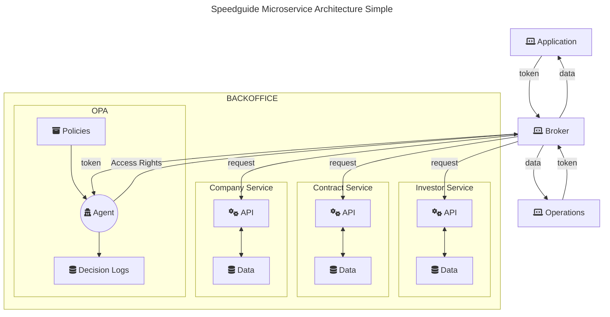

```mermaid
---
title: Speedguide Microservice Architecture Simple
---
flowchart TD
Application[fa:fa-laptop-code Application] & Operations[fa:fa-laptop-code Operations]
    --> |token| Broker[fa:fa-laptop-code Broker]
    --> |token| OPAgent --> |Access Rights| Broker
    Broker --> |request| CAPI & CoAPI & IAPI
    Broker --> |data| Application & Operations

    subgraph BACKOFFICE[BACKOFFICE]
    subgraph OPA[OPA]
    OPAgent((fa:fa-user-secret Agent)) --> OPAlog[fa:fa-database Decision Logs]
    OPApolicy[fa:fa-archive Policies] --> OPAgent
    end
    subgraph Company[Company Service]
    CAPI[fa:fa-cogs API] <--> CDB[fa:fa-database Data]
    end
    subgraph Contracts[Contract Service]
    CoAPI[fa:fa-cogs API] <--> CoDB[fa:fa-database Data]
    end
    subgraph Investors[Investor Service]
    IAPI[fa:fa-cogs API] <--> IDB[fa:fa-database Data]
    end
    end
```
