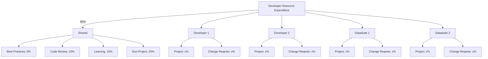

- [ ] Data Model and Access Review
- [ ] Azure Security Review

- [ ] Pass tests
- [ ] Code review, two people
- [ ] Squish Merge

```mermaid
 flowchart TD;
      A[Developer Resource Expenditure]--45%-->B[Shared];
      B-->C[Best Practices, 5%];
      B-->D[Code Review, 10%];
      B-->E[Learning, 10%];
      B-->F[Non-Project, 20%];
      A-->G[Developer 1];
      G-->G1[Project: x%]
      G-->G2[Change Reqests: x%]
      A-->H[Developer 2];
      H-->H1[Project: x%]
      H-->H2[Change Reqests: x%]
      A-->I[Datadude 1];
      I-->I1[Project: x%]
      I-->I2[Change Reqests: x%]
      A-->J[Datadude 2];
      J-->J1[Project: x%]
      J-->J2[Change Reqests: x%]
```
